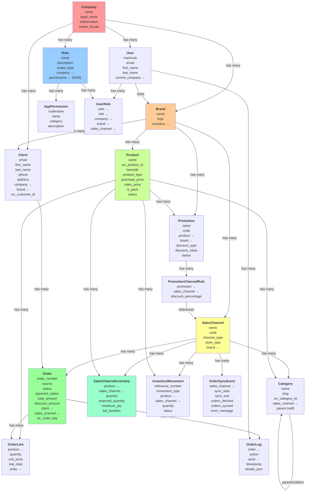

# LkSystem Backend - Architecture Analysis
## Senior Full Stack Developer Review

---

## 📋 System Overview

**LkSystem** is a **Multi-Tenant ERP (Enterprise Resource Planning)** system with:
- ✅ **Multi-tenant isolation** (Company as root tenant)
- ✅ **Multi-brand support** (Brands belong to Company)
- ✅ **Multi-channel distribution** (Warehouses, Retail stores, WooCommerce)
- ✅ **Advanced RBAC** (Role-Based Access Control with scoped permissions)
- ✅ **Order management** (POS, WooCommerce, Manual entry)
- ✅ **Inventory tracking** (Real-time stock management across channels)
- ✅ **Product promotions** (Channel-specific discounts)

---

## 🏗️ Complete Class Diagram



---

## 🔑 Key Entity Relationships

### Tenant Isolation (Multi-tenancy)
```
Company (Root Tenant)
├── User[1..n]           (Employees)
├── Brand[1..n]          (Sub-divisions)
│   ├── SalesChannel[1..n]    (Warehouses, Stores, WooCommerce)
│   ├── Product[1..n]         (Catalog)
│   └── Client[1..n]          (Customers)
└── RBAC_Role[1..n]     (Permission definitions)
```

### Sales Flow
```
Client → Order (POS/WooCommerce/Manual)
       ├── OrderLine[1..n]
       │   └── Product
       │       └── SalesChannelInventory
       └── OrderLog[1..n] (Audit trail)
```

### Inventory Management
```
Product × SalesChannel → SalesChannelInventory
                         ├── quantity
                         ├── reserved_qty (for pending orders)
                         └── available_qty = quantity - reserved_qty

InventoryMovement[1..n]
├── PURCHASE, RETURN_IN, TRANSFER_IN, ADJUSTMENT_IN
├── SALE, RETURN_OUT, TRANSFER_OUT, ADJUSTMENT_OUT, DAMAGE
```

### Promotions
```
Promotion
├── Product
├── Brand
└── PromotionChannelRule[1..n]  (Different discounts per channel)
```

### RBAC (Role-Based Access Control)
```
User
├── current_company (belongs to ONE company)
├── allowed_brands (M2M with multiple brands within company)
└── UserRole[1..n]  (Assigns roles at specific scopes)
    ├── Role
    │   └── AppPermission[1..n]  (Business permissions)
    └── Scope: Platform | Company | Brand | Sales Channel
```

---

## 📊 Data Model Details

### 1️⃣ **Company Model**
**Represents**: Parent organization / Tenant
- `name` - Commercial name
- `abbreviation` - Auto-generated (max 5 chars, UPPERCASE)
- `matricule_fiscale` - Tax ID
- `bank_account` - Payment method
- **Tenant Root**: All other entities scoped by company_id

### 2️⃣ **User Model**
**Represents**: Employee / System user
- `matricule` (USERNAME_FIELD) - e.g., "COMP-0001"
- `email` - Unique
- `current_company` - FK (belongs to ONE company)
- `allowed_brands` - M2M (can access multiple brands in current_company)
- **RBAC Integration**: Permissions via UserRole assignments

### 3️⃣ **Brand Model**
**Represents**: Sub-brand or business unit within a company
- `name` - Brand name
- `company` - FK (tenant isolation)
- `logo` - Brand imagery
- **Purpose**: Separate product lines, pricing, or business units

### 4️⃣ **SalesChannel Model**
**Represents**: Distribution point (warehouse, retail store, online)
- `channel_type` - WOOCOMMERCE | POS | WEB
- `store_type` - WAREHOUSE | RETAIL | DISTRIBUTION
- `brand` - FK (belongs to a brand)
- `wc_store_url` - WooCommerce API endpoint
- `code` - Unique code (e.g., WH001, STR-TUN)
- **Purpose**: Multi-location inventory & sales management

### 5️⃣ **Product Model**
**Represents**: Inventory item
- `name` - Product name
- `wc_product_id` - WooCommerce sync reference (0 for local-only)
- `barcode` - SKU/barcode
- `product_type` - RESELL | PACKAGING
- `status` - PUBLISH | DRAFT | PENDING | PRIVATE
- `purchase_price`, `sales_price` - Cost & selling price
- `is_pack` - Boolean (composite product)
- `pack_items` - JSON (list of contained products if is_pack=true)
- **Soft Delete**: `is_deleted` boolean (paranoid delete)

### 6️⃣ **Category Model**
**Represents**: Product categorization (WooCommerce synchronized)
- `wc_category_id` - WooCommerce ID
- `name`, `slug` - Category metadata
- `sales_channel` - FK (categories are per-channel)
- `parent` - Self-referential (hierarchical)
- `display_order` - Menu order
- **Sync**: `last_synced_at` tracks WooCommerce updates

### 7️⃣ **Client Model**
**Represents**: Customer / End-user
- `email`, `phone` - Contact info
- `company`, `brand` - FK (tenant isolation + brand association)
- `wc_customer_id` - WooCommerce sync
- `source` - WOOCOMMERCE | POS | MANUAL
- `sales_channel` - Originating channel
- `reseller` - Self-referential (B2B: wholesaler relationships)
- **Auto-creation**: Generated from WooCommerce orders or POS transactions

### 8️⃣ **Order Model**
**Represents**: Sales transaction
- `order_number`, `wc_order_key` - Identifiers
- `source` - WOOCOMMERCE | POS | MANUAL
- `status` - PENDING | PROCESSING | ON_HOLD | COMPLETED | CANCELLED | REFUNDED | FAILED
- `payment_status` - UNPAID | PAID | PARTIAL | REFUNDED
- `delivery_status` - NONE | PENDING | QUEUED | SUBMITTED | ACCEPTED | IN_TRANSIT | DELIVERED | FAILED | CANCELLED | RETURNED
- `total_amount`, `discount_amount` - Financials
- `client`, `sales_channel`, `created_by` - References
- `raw_wc_payload` - Raw WooCommerce data (audit)
- **Delivery Tracking**: Separate from order status (can track shipment independently)

### 9️⃣ **OrderLine Model**
**Represents**: Individual line item in an order
- `order` - FK
- `product` - FK
- `quantity`, `unit_price`, `line_total` - Pricing
- `discount_applied` - Promotion applied
- **Soft Delete**: `is_deleted` (supports line cancellation)

### 🔟 **SalesChannelInventory Model**
**Represents**: Stock level per product per channel
- `product`, `sales_channel` - Composite key (unique_together)
- `quantity` - Current stock
- `reserved_quantity` - Stock pending fulfillment
- `minimum_quantity` - Reorder point (low-stock alert)
- `maximum_quantity` - Warehouse capacity
- `bin_location` - Physical location (e.g., "A1-B2")
- `last_counted_at` - Physical count date
- **Computed Properties**:
  - `available_quantity` = quantity - reserved_quantity
  - `is_low_stock` = quantity <= minimum_quantity
  - `is_out_of_stock` = available_quantity <= 0

### 1️⃣1️⃣ **InventoryMovement Model**
**Represents**: Audit trail of all inventory changes
- `reference_number` - Unique movement ID
- `movement_type` - 8 types:
  - **IN**: PURCHASE, RETURN_IN, TRANSFER_IN, ADJUSTMENT_IN, INITIAL
  - **OUT**: SALE, RETURN_OUT, TRANSFER_OUT, ADJUSTMENT_OUT, DAMAGE
- `product`, `sales_channel` - References
- `quantity_moved`, `quantity_before`, `quantity_after` - Full audit
- `movement_status` - PENDING | COMPLETED | CANCELLED
- **Purpose**: 100% audit trail (regulatory compliance)

### 1️⃣2️⃣ **Promotion Model**
**Represents**: Discount campaign
- `name`, `code` - Promo identifier
- `product`, `brand` - What is being promoted
- `discount_type` - PERCENTAGE | FIXED_AMOUNT
- `discount_value` - 10.5 or 50.00
- `status` - DRAFT | SCHEDULED | ACTIVE | PAUSED | EXPIRED | CANCELLED
- `valid_from`, `valid_until` - Time window
- **Channel Rules**: `PromotionChannelRule` allows different discounts per channel

### 1️⃣3️⃣ **PromotionChannelRule Model**
**Represents**: Channel-specific discount override
- `promotion` - FK
- `sales_channel` - FK
- `discount_percentage` - Override (if different from default)
- **Use Case**: Same product, different prices on different channels

### 1️⃣4️⃣ **RBAC: AppPermission Model**
**Represents**: Business-level permission (NOT Django's auth.Permission)
- `codename` - Machine ID (e.g., "manage_products", "use_pos")
- `name` - Human-readable (e.g., "Manage Products")
- `category` - Grouping (e.g., "products", "orders", "inventory")
- **Examples**:
  - `products:manage_products`
  - `orders:create_pos_order`
  - `inventory:adjust_stock`
  - `reports:export_data`

### 1️⃣5️⃣ **RBAC: Role Model**
**Represents**: Collection of permissions
- `name` - Role name (e.g., "Manager", "Cashier")
- `scope_type` - PLATFORM | COMPANY | BRAND | CHANNEL
- `company` - FK (NULL for platform roles)
- `permissions` - M2M with AppPermission
- `is_system` - Cannot delete/rename system roles
- **Example Hierarchy**:
  - Platform: SuperAdmin (all permissions)
  - Company: Manager (manage company)
  - Brand: Supervisor (manage brand only)
  - Channel: Cashier (use POS only)

### 1️⃣6️⃣ **RBAC: UserRole Model**
**Represents**: Assignment of role to user at a specific scope
```
User has multiple UserRoles:
├── UserRole(user=john, role=Manager, company=LkCompany)  [Company-level]
├── UserRole(user=john, role=Supervisor, brand=Nike, company=LkCompany)  [Brand-level]
└── UserRole(user=john, role=Cashier, sales_channel=WH001, company=LkCompany)  [Channel-level]
```
- `user` - FK to User
- `role` - FK to Role
- `company`, `brand`, `sales_channel` - Scope definition
  - If all NULL → Platform-level
  - If only `company` set → Company-level
  - If `brand` set → Brand-level
  - If `sales_channel` set → Channel-level
- **Permission Cascade**: Company-level permissions grant access to all brands & channels

### 1️⃣7️⃣ **OrderLog Model**
**Represents**: Audit trail of order state changes
- `order` - FK
- `action` - CREATED | UPDATED | STATUS_CHANGED | PAYMENT_RECEIVED | DELIVERY_SUBMITTED | etc.
- `actor` - FK to User (who made the change)
- `timestamp` - When the change occurred
- `details_json` - Additional context
- **Purpose**: Full audit trail for compliance & debugging

### 1️⃣8️⃣ **OrderSyncEvent Model**
**Represents**: WooCommerce synchronization event
- `sales_channel` - Which WooCommerce store
- `sync_start`, `sync_end` - When the sync happened
- `orders_fetched` - Count from WooCommerce API
- `orders_synced` - Count saved to DB
- `error_message` - Any errors encountered
- **Purpose**: Track integration health & debug sync issues

---

## 🎯 Core Use Cases

### 1. **E-Commerce Order Ingestion (WooCommerce)**
**Actors**: Customer, WooCommerce, Backend System
**Flow**:
1. Customer places order on WooCommerce store
2. Webhook notifies backend (`/api/webhooks/orders/`)
3. OrderIngestionService:
   - Fetches order details from WC API
   - Auto-creates Client if new email
   - Creates Order + OrderLines
   - Reserves inventory (OrderLine qty → SalesChannelInventory.reserved_qty)
   - Creates OrderLog entry
4. Dashboard shows order as PROCESSING
5. Staff can confirm/delay/cancel via UI

**Status Transitions**: PENDING → PROCESSING → (COMPLETED | CANCELLED | REFUNDED)

---

### 2. **Point of Sale (POS) Order Creation**
**Actors**: Cashier, POS Terminal
**Flow**:
1. Cashier scans product barcode (or manual entry)
2. POS endpoint creates Order with `source=POS`
3. Inventory automatically reserved
4. Payment collected (PAID status)
5. Receipt printed
6. Order marked COMPLETED

**Database Updates**:
- Order created with source=POS
- OrderLine created for each item
- SalesChannelInventory.reserved_qty increased
- OrderLog entry created

---

### 3. **Multi-Channel Inventory Synchronization**
**Actors**: Warehouse Manager, System background task
**Flow**:
1. **Real-time updates** (from UI):
   - Admin updates `SalesChannelInventory.quantity`
   - InventoryMovement record created (type=ADJUSTMENT_IN/OUT)
   - available_qty automatically recalculated

2. **Bulk Stock Adjustment**:
   - Physical count done (warehouse staff counts shelves)
   - Upload CSV with new quantities
   - For each product: create InventoryMovement (type=TRANSFER_IN/OUT to adjust)

3. **Inter-channel Transfers**:
   - Admin moves stock: WH001 → WH002
   - Creates 2 InventoryMovements:
     - TRANSFER_OUT from WH001
     - TRANSFER_IN to WH002

4. **Stock Alerts**:
   - Cron job checks `is_low_stock` property
   - Notifies when quantity <= minimum_quantity

---

### 4. **Delivery Management Lifecycle**
**Status Flow** (independent from Order Status):
```
NONE (not applicable)
 ↓
PENDING (order placed, waiting to ship)
 ↓
QUEUED (prepared for delivery)
 ↓
SUBMITTED (given to delivery partner)
 ↓
ACCEPTED (partner accepted)
 ↓
IN_TRANSIT (on the way)
 ↓
DELIVERED ✓

OR

FAILED → retry possible
CANCELLED → no fulfillment
RETURNED → customer rejected
```

**Actors**: Warehouse staff, Delivery partner, Admin
**Flow**:
1. Order created (delivery_status=PENDING)
2. Warehouse picks items → QUEUED
3. Package handed to courier → SUBMITTED
4. Courier notifies backend → ACCEPTED
5. GPS tracking → IN_TRANSIT
6. Customer signs → DELIVERED
7. OrderLog tracks each state change

---

### 5. **Role-Based Access Control (RBAC)**
**Actors**: Super Admin, Company Manager, Brand Manager, Cashier
**Scenario**:
```
1. Super Admin creates AppPermission: "use_pos" → category="orders"

2. Company Manager creates Role: "Cashier"
   - Assigns permission: "use_pos"
   - Sets scope_type: "channel"

3. Company Manager creates UserRole:
   - user: John (cashier)
   - role: Cashier
   - sales_channel: WH001
   → John can only use POS at WH001

4. System checks permission:
   PermissionService.has_permission(user=john, codename="use_pos")
   → True (if assigned)

5. Conditional UI elements:
   if (user.has_permission('use_pos')) {
     show POS button
   }
```

**Scope Cascade**:
- Platform-level: All data
- Company-level: All brands & channels in company
- Brand-level: Only that brand
- Channel-level: Only that channel

---

### 6. **Product & Category Synchronization from WooCommerce**
**Actors**: WooCommerce store, Backend system
**Flow** (One-time setup):
1. Admin provides WooCommerce store URL + API credentials
2. Backend polls WC API:
   - Fetches all products → Create Product records
   - Fetches all categories → Create Category records (with hierarchy)
   - Fetches all customers → Create Client records
3. Creates SalesChannel record with WC credentials

**Ongoing Sync** (Webhooks):
1. Store owner updates product price on WooCommerce
2. Webhook triggers `/api/webhooks/products/`
3. Backend updates Product.sales_price
4. Frontend fetches new price (React Query refetch)

---

### 7. **Channel-Specific Promotions**
**Actors**: Marketing Manager
**Scenario**:
```
Nike Shoes:
├── Purchase Price: 30 TND
├── Default Sales Price: 89 TND
└── Promotions:
    ├── WooCommerce (online): 20% off → 71.20 TND
    └── Retail Store: 15% off → 75.65 TND
    └── Warehouse: No discount → 89 TND
```

**Database**:
```
Promotion(name="Nike Summer Sale", product_id=123, brand_id=5)

PromotionChannelRule[
  {sales_channel=WC, discount=20%},
  {sales_channel=RETAIL, discount=15%},
  {sales_channel=WH, discount=0%}
]
```

**At Checkout**:
```python
# Get promotion
promo_rule = PromotionChannelRule.objects.get(
    sales_channel=order.sales_channel,
    promotion__product=product
)
if promo_rule:
    discount = product.sales_price * (promo_rule.discount_percentage / 100)
    final_price = product.sales_price - discount
```

---

### 8. **Multi-Tenant Data Isolation**
**Scenario**: 2 companies (LkCompany, AnotherCo) in same database
```
LkCompany (company_id=1)
├── Brand: Nike
├── Brand: Adidas
└── Users: Can only see their company data

AnotherCo (company_id=2)
├── Brand: Puma
└── Users: Can only see their company data

Queries automatically scoped:
Product.objects.filter(brand__company=request.user.company)
  → Returns only Nike, Adidas products

Order.objects.filter(sales_channel__brand__company=request.user.company)
  → Returns only LkCompany orders
```

**Under the hood** (view decorator):
```python
@require_company_context
def get_products(request):
    # request.company is auto-set from request.user.current_company
    products = Product.objects.filter(brand__company=request.company)
```

---

## 🔐 Security Patterns

### 1. **Tenant Isolation (Multi-tenancy)**
- Every query filters by `company_id`
- Users belong to exactly ONE company
- Cannot access other companies' data

### 2. **Permission Scoping**
- Permissions are scoped (Platform | Company | Brand | Channel)
- Users can have different roles at different scopes
- Permissions cascade downward

### 3. **Audit Trails**
- OrderLog: Every order change tracked
- InventoryMovement: Every stock change tracked
- OrderSyncEvent: Integration health logged
- Created_by, Created_at, Updated_at on all models

### 4. **Soft Deletes** (using is_deleted flag)
```python
# Prevent accidental data loss
Product.objects.filter(is_deleted=False)  # Default manager
Product.all_objects.all()  # Include deleted (for recovery)
```

### 5. **Unique Constraints**
- `User.matricule` - Unique per company
- `Product.wc_product_id` - Unique per brand
- `Brand.name` - Unique per company

---

## 📈 Performance Optimization Patterns

### 1. **Select Related / Prefetch Related**
```python
# OrderViewSet
queryset = Order.objects.select_related(
    'company', 'sales_channel', 'client', 'created_by', 'company'
)
```

### 2. **Database Indexes**
```python
# SalesChannelInventory
indexes = [
    models.Index(fields=['sales_channel', 'product']),
    models.Index(fields=['product']),
    models.Index(fields=['quantity']),
]
```

### 3. **Manager Pattern**
```python
# Active products only (soft delete aware)
class ProductManager(models.Manager):
    def get_queryset(self):
        return super().get_queryset().filter(is_deleted=False)

class Product(models.Model):
    objects = ProductManager()  # Default: excludes deleted
    all_objects = AllProductsManager()  # Include deleted
```

---

## 🛠️ API Endpoints (ViewSet Actions)

### Orders
- `GET /api/v1/orders/` - List all orders
- `GET /api/v1/orders/{id}/` - Order details
- `POST /api/v1/orders/preview/` - Fetch WC orders without saving
- `POST /api/v1/orders/sync/` - Fetch & save WC orders
- `POST /api/v1/orders/{id}/confirm/` - Mark as confirmed
- `POST /api/v1/orders/{id}/delay/` - Mark as delayed
- `POST /api/v1/orders/{id}/cancel/` - Cancel order
- `POST /api/v1/orders/{id}/delivery-status/` - Update delivery status

### Inventory
- `GET /api/v1/inventory/` - Inventory levels
- `POST /api/v1/inventory/{id}/adjust/` - Adjust stock
- `GET /api/v1/inventory-movement/` - Audit trail

### Promotions
- `GET /api/v1/promotions/` - List promotions
- `POST /api/v1/promotions/` - Create promotion
- `PATCH /api/v1/promotions/{id}/` - Update

### Products
- `GET /api/v1/products/` - Product catalog
- `POST /api/v1/products/` - Create product

---

## 📊 Senior Developer Observations

### ✅ **Strengths**

1. **Well-designed multi-tenancy** - Proper isolation at Company level
2. **Soft deletes** - Data recovery & compliance friendly
3. **RBAC with scopes** - Fine-grained permission management
4. **Audit trails** - Full tracking of order & inventory changes
5. **Separation of concerns** - Services handle business logic
6. **Manager pattern** - Clean soft-delete handling
7. **Foreign key constraints** - Data integrity (CASCADE, PROTECT policies)

### ⚠️ **Recommendations**

1. **Add Database Transactions**
   ```python
   # When creating order + reserving inventory
   with transaction.atomic():
       order = Order.objects.create(...)
       inventory.reserved_qty += qty
       inventory.save()
   ```

2. **Add Webhook Validation**
   - Verify WooCommerce signature header
   - Prevent duplicate webhook processing

3. **Consider Caching**
   ```python
   # Cache active promotions (rarely change)
   @cache_result(timeout=3600)
   def get_channel_promotions(channel_id):
       ...
   ```

4. **Add Rate Limiting**
   - Protect `/api/webhooks/` from abuse
   - Limit POS creation per channel

5. **Add Request Logging Middleware**
   - Track API usage per user/channel
   - Detect unusual patterns

6. **Batch Operations for WooCommerce Sync**
   - Use bulk_create for bulk inserts
   - Bulk update inventory from CSV

---

## 🚀 Key Takeaway

**LkSystem** is a **mature, well-architected ERP** with:
- ✅ Multi-tenancy at the core
- ✅ Professional RBAC system
- ✅ Strong audit trails
- ✅ Clean separation of concerns
- ✅ Ready for production deployment

The architecture supports scaling from a single-brand startup to a large multi-brand enterprise with dozens of stores and channels.

