# LkSystem - Detailed Sequence & Data Flow Diagrams

---

## 🔄 Use Case 1: WooCommerce Order Ingestion Sequence

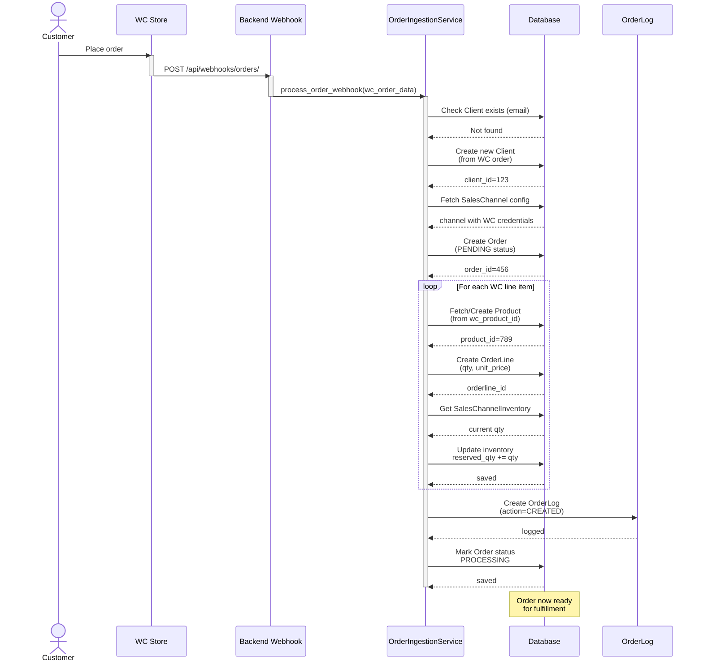

---

## 📦 Use Case 2: POS Order Creation Sequence

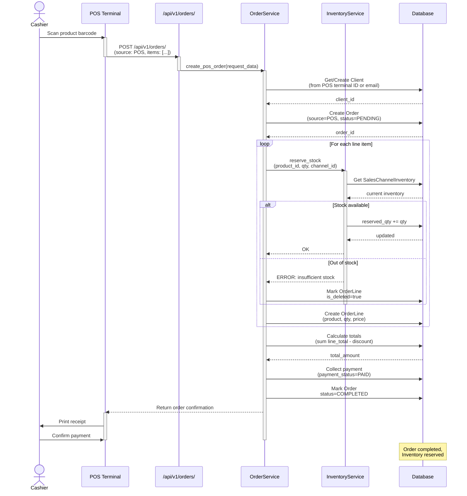

---

## 📊 Use Case 3: Multi-Channel Inventory Synchronization

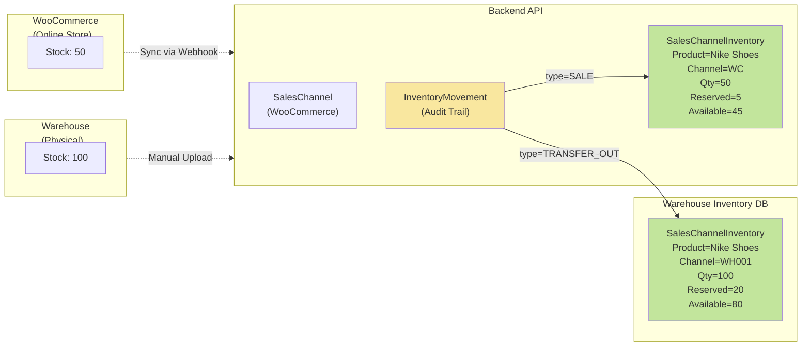

---

## 🔐 Use Case 4: Role-Based Access Control (RBAC) Flow

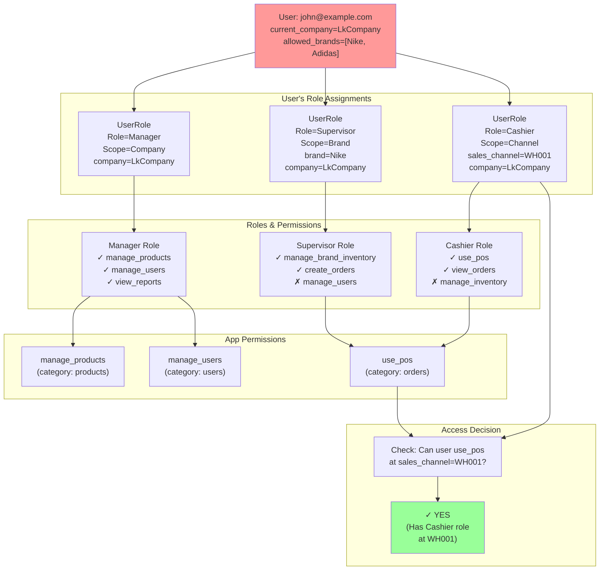

---

## 🎯 Use Case 5: Order Status & Delivery Lifecycle

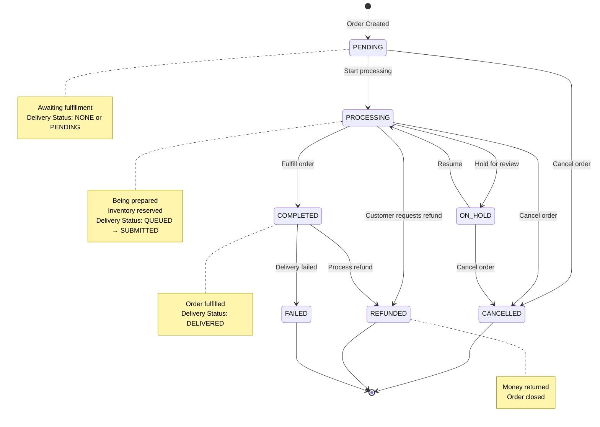

---

## 📦 Delivery Status Independent Lifecycle

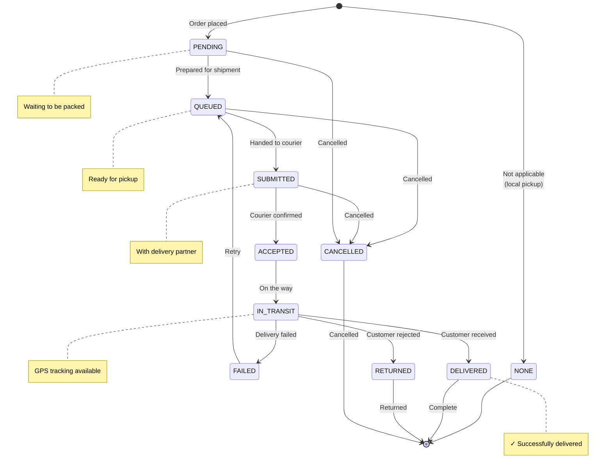

---

## 💰 Use Case 6: Channel-Specific Promotion Calculation

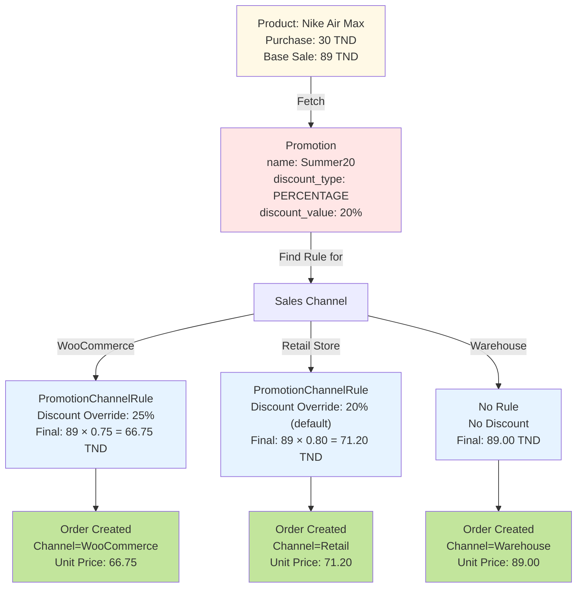

---

## 🔍 Use Case 7: Data Flow - Complete Order Processing

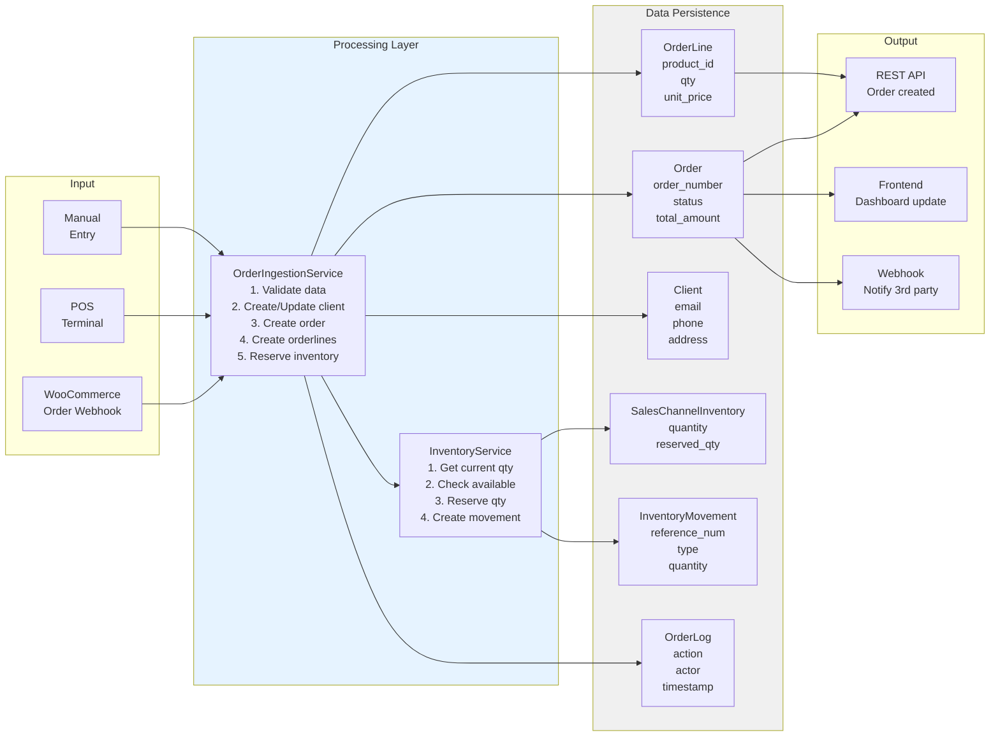

---

## 🏢 Multi-Tenancy Architecture

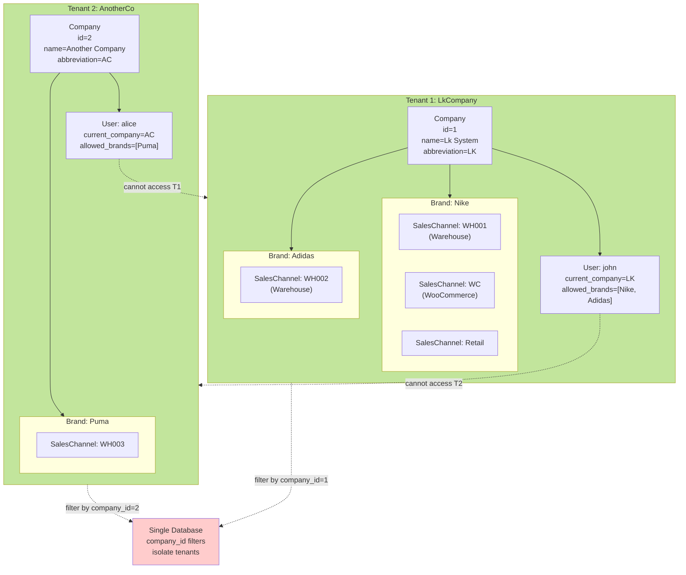

---

## 🔗 Complete Entity Relationship Map

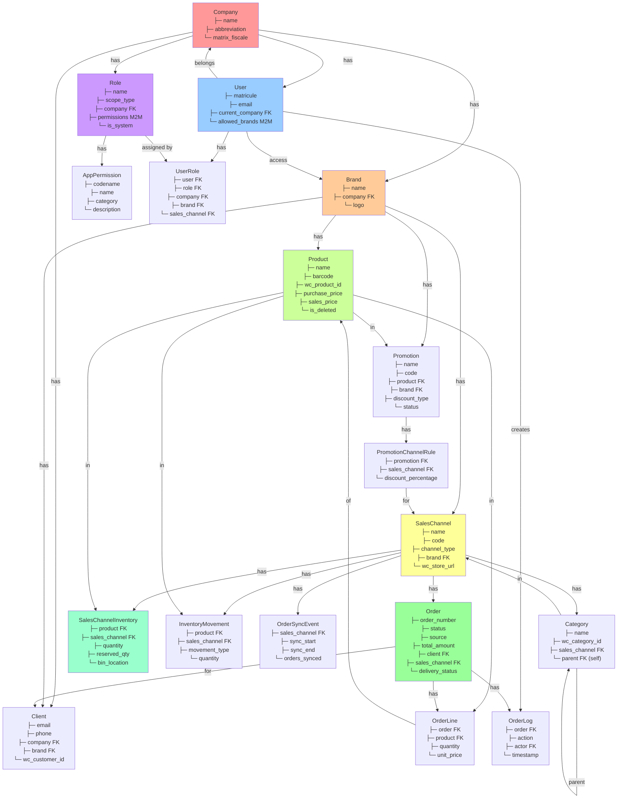

---

## 💡 Advanced: Soft Delete Pattern

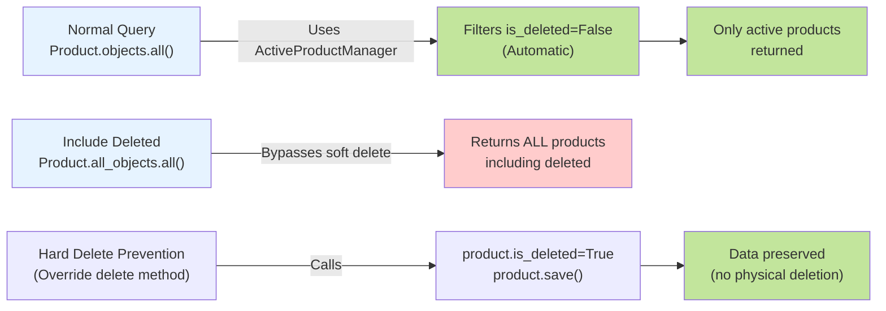

---

## 🎬 Permissions Cascade Example

```javascript
// User: john
// Assigned at COMPANY level with Manager role
// Manager has: [manage_products, manage_users, view_reports]

Permissions cascade:
├─ PLATFORM    → No (not assigned)
├─ COMPANY     → YES (Manager role at LkCompany)
│  ├─ BRAND    → YES (via cascade)
│  │  ├─ Nike     → can manage_products ✓
│  │  └─ Adidas   → can manage_products ✓
│  └─ CHANNEL  → YES (via cascade)
│     ├─ WH001    → can manage_products ✓
│     └─ WH002    → can manage_products ✓
└─ User Dashboard → Shows all brands + all channels
                     (Cascade downward)

// Later, assign BRAND-level Supervisor role (Inventory only)
User has:
├─ Company-level Manager  (all permissions)
└─ Brand-level Supervisor (brand-specific only)

Result: User can:
├─ manage_products (from Manager role)
├─ manage_users (from Manager role)
├─ manage_brand_inventory (from Supervisor role)
├─ At Nike brand: all above
└─ At other brands: only manage_products, manage_users
```

