# LkSystem - System Design Diagrams

This document summarizes the main modules of the LkSystem ERP project and provides reusable Mermaid diagrams for use cases, workflows, and sequences.

## 1. Global System Context

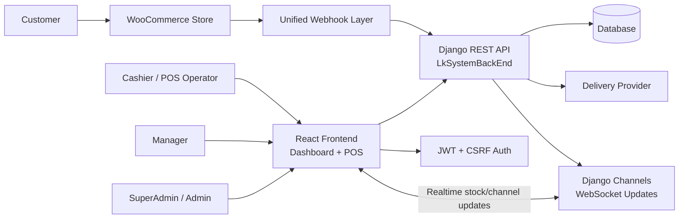

## 2. Module Dependency Diagram

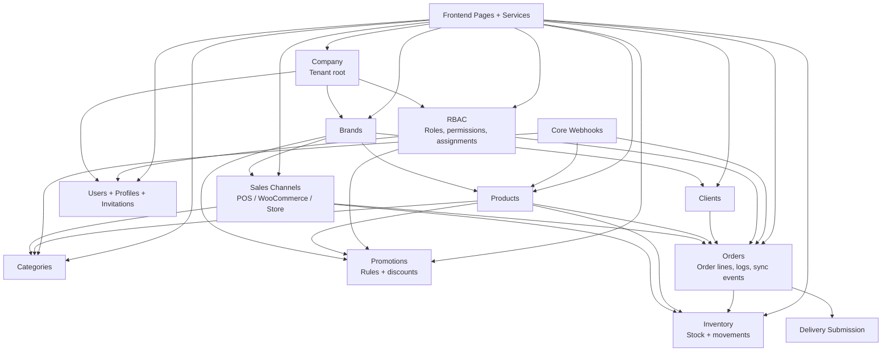

## 3. Main Actors

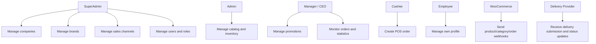

## 4. Frontend Navigation Workflow

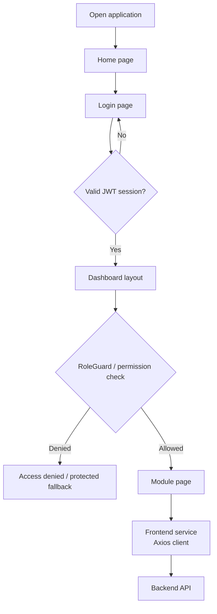

## 5. Authentication And User Module

### Use Cases

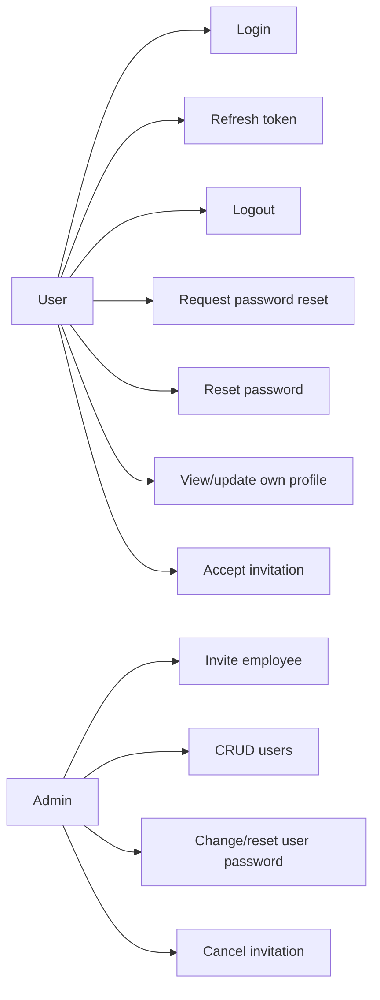

### Workflow

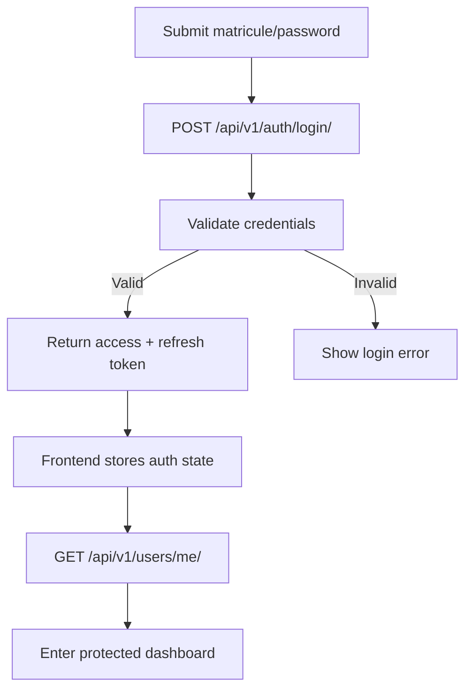

### Sequence

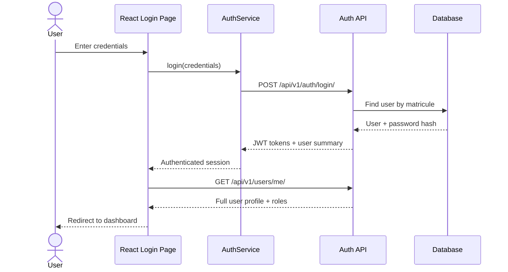

## 6. Company, Brand, And Sales Channel Modules

### Use Cases

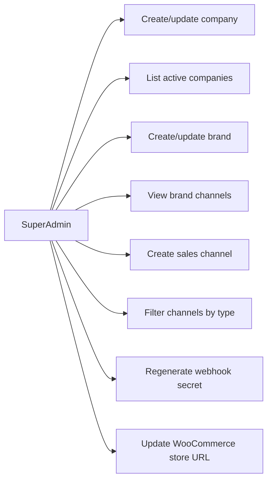

### Workflow

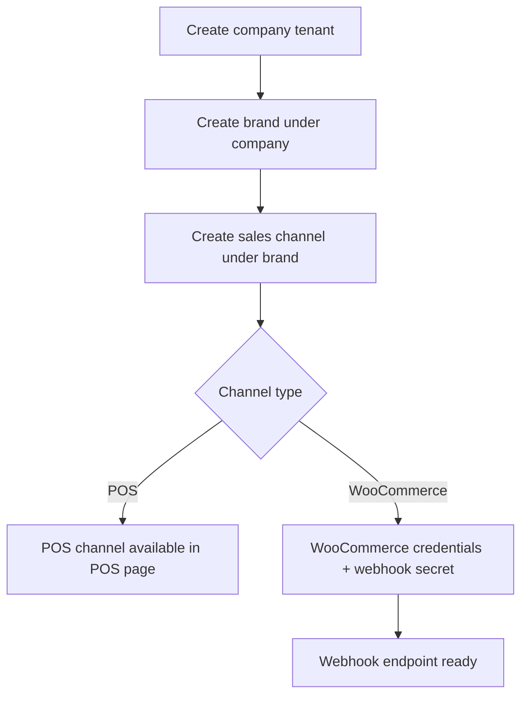

### Sequence

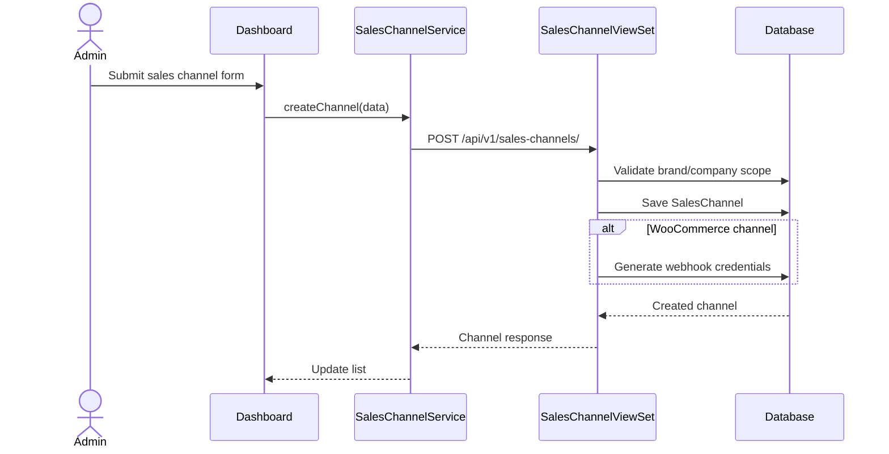

## 7. RBAC Module

### Use Cases

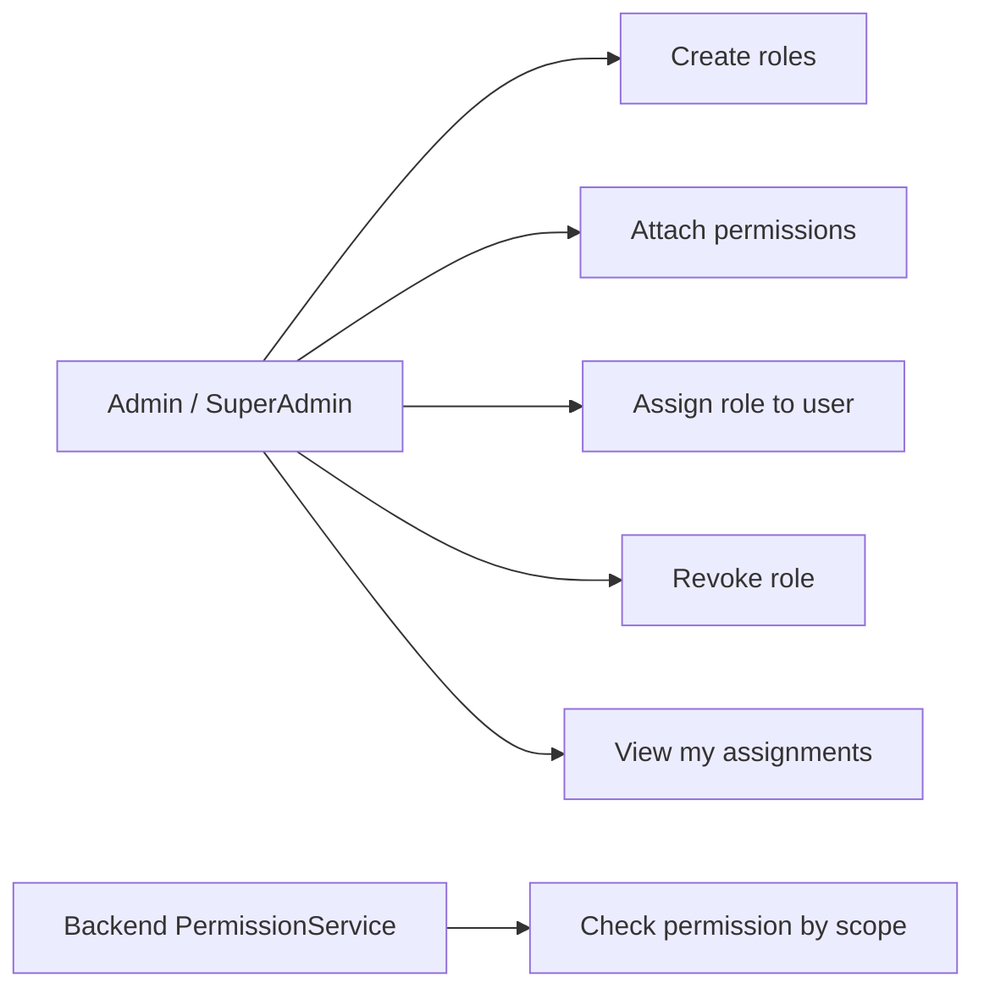

### Workflow

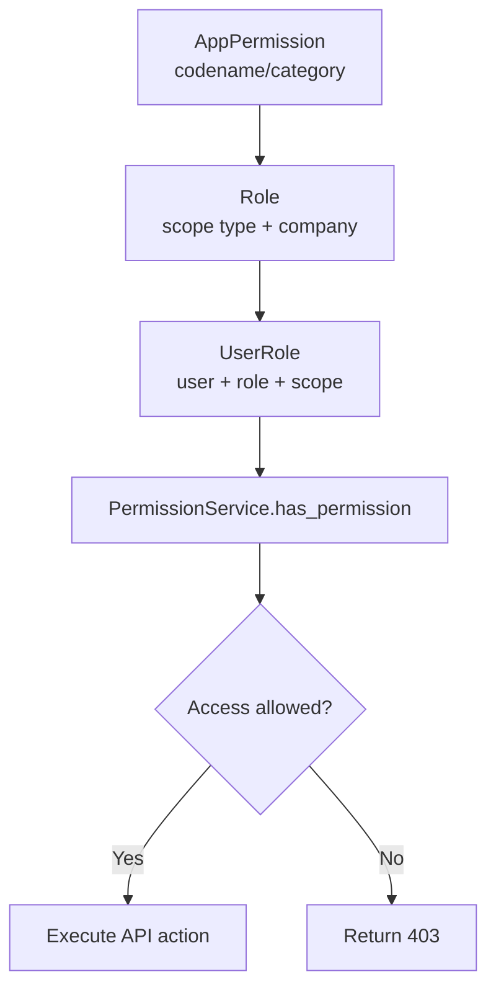

### Sequence

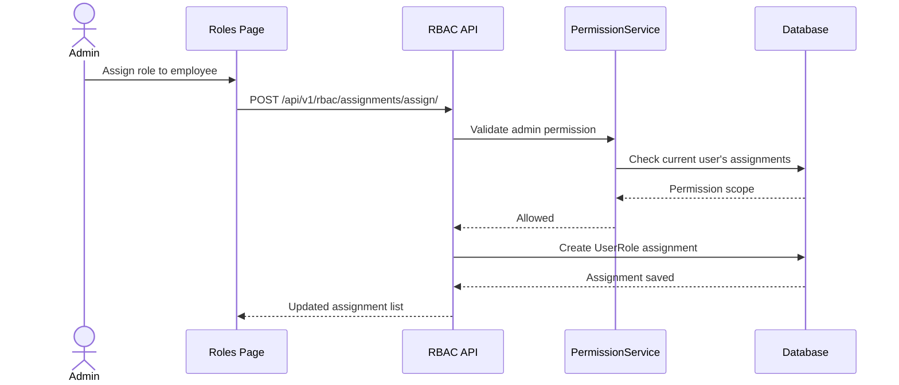

## 8. Product And Category Modules

### Use Cases

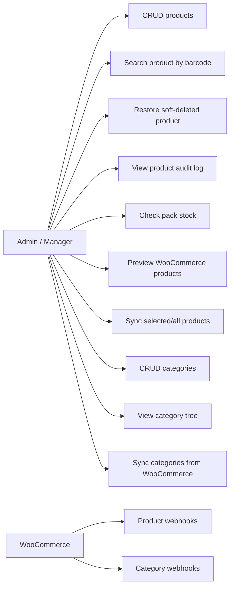

### Workflow

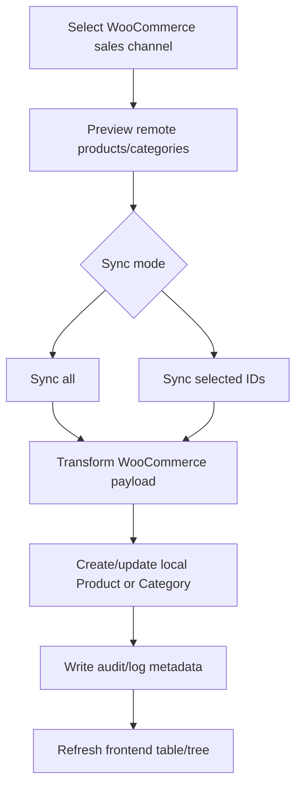

### Sequence

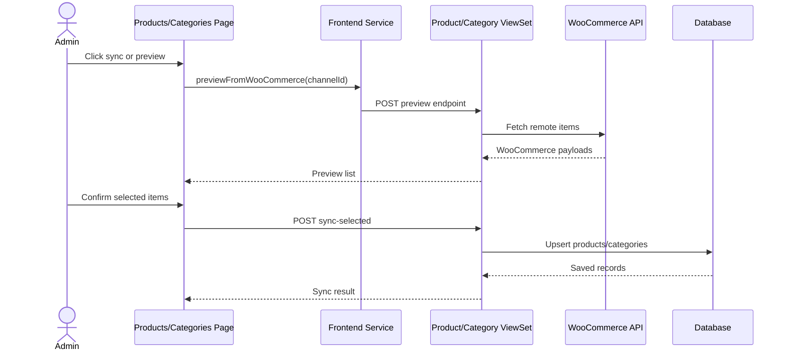

## 9. Inventory Module

### Use Cases

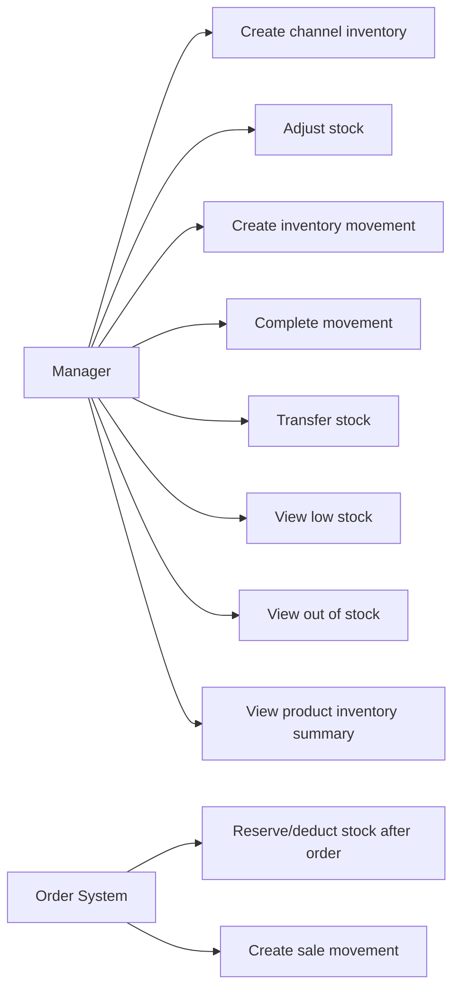

### Workflow

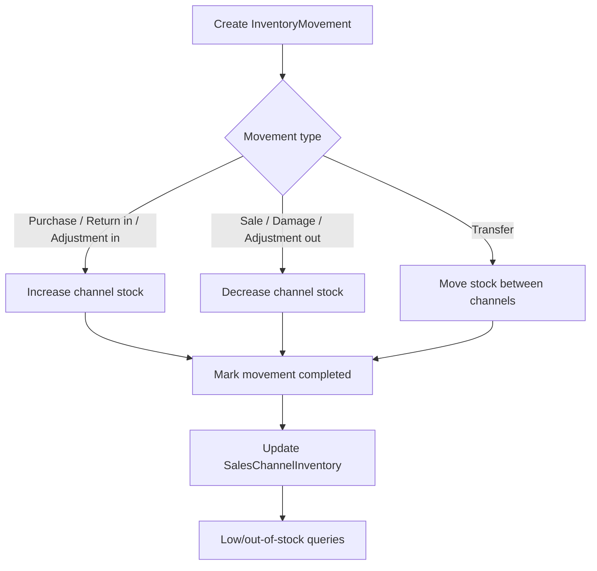

### Sequence

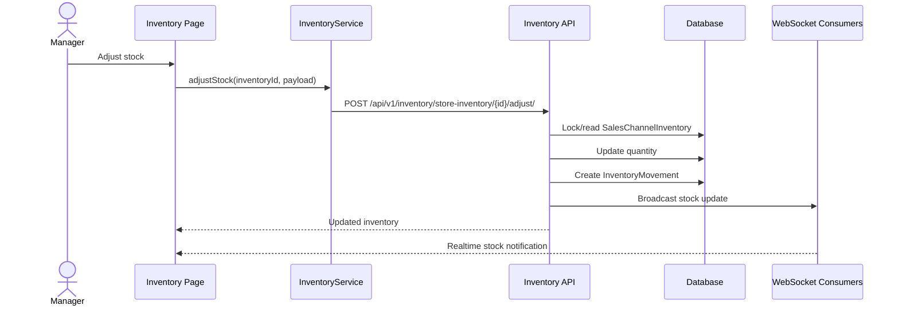

## 10. Promotions Module

### Use Cases

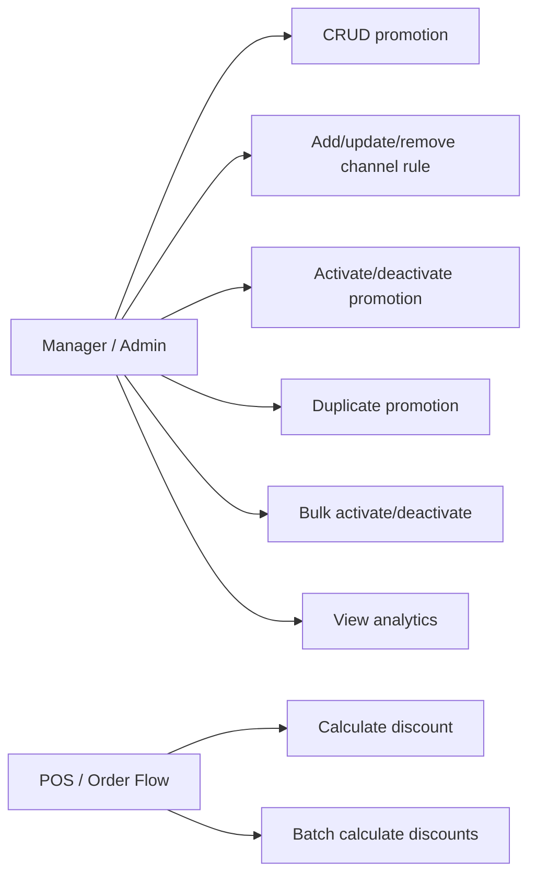

### Workflow

```mermaid
flowchart TD
    Promotion["Promotion\nproduct + brand + validity"]
    Rule["PromotionChannelRule\nchannel-specific discount"]
    Activate["Activate promotion"]
    POSRequest["POS asks for discount"]
    Validate{"Active, valid dates,\nchannel + product match?"}
    Calculate["Calculate discount amount"]
    NoDiscount["Return no discount"]

    Promotion --> Rule --> Activate --> POSRequest --> Validate
    Validate -->|Yes| Calculate
    Validate -->|No| NoDiscount
```

### Sequence

```mermaid
sequenceDiagram
    actor Cashier
    participant POS as POS Page
    participant PromoAPI as Promotion API
    participant DB as Database

    Cashier->>POS: Add product to cart
    POS->>PromoAPI: POST /api/v1/promotions/calculate_discount/
    PromoAPI->>DB: Find active promotion for product/brand
    PromoAPI->>DB: Check channel rule
    alt Promotion valid
        PromoAPI-->>POS: Discount type/value/final price
    else No active promotion
        PromoAPI-->>POS: No discount
    end
    POS-->>Cashier: Show adjusted line total
```

## 11. Clients Module

### Use Cases

```mermaid
flowchart LR
    Staff["Staff / Cashier"]
    OrderSystem["Order System"]

    Staff --> CL1["CRUD clients"]
    Staff --> CL2["Create client from POS"]
    Staff --> CL3["Block/unblock client"]
    Staff --> CL4["Filter/search clients"]
    OrderSystem --> CL5["Resolve or create client during order ingestion"]
```

### Workflow

```mermaid
flowchart TD
    Source{"Client source"}
    Manual["Manual dashboard form"]
    POS["POS client dialog"]
    WC["WooCommerce order billing data"]
    Validate["Validate company/brand scope"]
    Deduplicate["Check email or phone"]
    Save["Create/update Client"]
    UseInOrder["Attach client to order"]

    Source --> Manual
    Source --> POS
    Source --> WC
    Manual --> Validate
    POS --> Validate
    WC --> Validate
    Validate --> Deduplicate --> Save --> UseInOrder
```

### Sequence

```mermaid
sequenceDiagram
    actor Cashier
    participant POS as POS Page
    participant ClientAPI as Client API
    participant DB as Database

    Cashier->>POS: Add new POS client
    POS->>ClientAPI: POST /api/v1/clients/create-from-pos/
    ClientAPI->>DB: Validate current company/brand
    ClientAPI->>DB: Check existing phone/email
    ClientAPI->>DB: Save Client
    DB-->>ClientAPI: Client record
    ClientAPI-->>POS: Client payload
    POS-->>Cashier: Client attached to cart
```

## 12. Orders And POS Module

### Use Cases

```mermaid
flowchart LR
    Cashier["Cashier"]
    Manager["Manager"]
    Woo["WooCommerce"]
    Delivery["Delivery Provider"]

    Cashier --> O1["Create POS order"]
    Cashier --> O2["Scan barcode"]
    Cashier --> O3["Print receipt/invoice"]
    Manager --> O4["List/filter orders"]
    Manager --> O5["Update status"]
    Manager --> O6["Edit order"]
    Manager --> O7["Soft delete/restore order"]
    Manager --> O8["Confirm/delay/cancel outcome"]
    Manager --> O9["View order logs"]
    Manager --> O10["View order summary"]
    Woo --> O11["Sync/preview/import orders"]
    Delivery --> O12["Receive submitted delivery"]
```

### POS Workflow

```mermaid
flowchart TD
    OpenPOS["Open POS page"]
    SelectChannel["Select POS sales channel"]
    Scan["Scan barcode or select product"]
    ProductLookup["GET /products/search_barcode"]
    AddCart["Add item to cart"]
    Discount["Calculate promotion discount"]
    Client{"Client attached?"}
    AddClient["Select/create client"]
    Submit["POST /orders/pos/"]
    Inventory["Create sale movement / update stock"]
    Complete["Order completed"]
    Print["Print receipt or invoice"]

    OpenPOS --> SelectChannel --> Scan --> ProductLookup --> AddCart --> Discount --> Client
    Client -->|No| AddClient --> Submit
    Client -->|Yes| Submit
    Submit --> Inventory --> Complete --> Print
```

### POS Sequence

```mermaid
sequenceDiagram
    actor Cashier
    participant POS as POS Page
    participant ProductAPI as Product API
    participant PromoAPI as Promotion API
    participant OrderAPI as Order API
    participant Inventory as Inventory
    participant DB as Database

    Cashier->>POS: Scan product barcode
    POS->>ProductAPI: GET /api/v1/products/search_barcode/
    ProductAPI->>DB: Find active product
    ProductAPI-->>POS: Product + price
    POS->>PromoAPI: Calculate discount
    PromoAPI-->>POS: Discount result
    Cashier->>POS: Confirm payment
    POS->>OrderAPI: POST /api/v1/orders/pos/
    OrderAPI->>DB: Create Order + OrderLines
    OrderAPI->>Inventory: Create sale movements
    Inventory->>DB: Update channel inventory
    OrderAPI->>DB: Create OrderLog
    OrderAPI-->>POS: Order confirmation
    POS-->>Cashier: Print receipt
```

### Order Management Sequence

```mermaid
sequenceDiagram
    actor Manager
    participant FE as Orders Page
    participant API as OrderViewSet
    participant OMS as OrderManagementService
    participant Logs as OrderLoggingService
    participant DB as Database

    Manager->>FE: Edit order
    FE->>API: PATCH /api/v1/orders/{id}/edit/
    API->>OMS: edit_order(order, data, actor)
    OMS->>DB: Update order fields
    OMS->>DB: Update order lines
    OMS->>Logs: Record change details
    Logs->>DB: Create OrderLog
    DB-->>API: Updated order
    API-->>FE: Order detail
```

## 13. WooCommerce Webhook And Sync Module

### Use Cases

```mermaid
flowchart LR
    Woo["WooCommerce"]
    Admin["Admin"]
    Webhook["Unified Webhook API"]

    Woo --> W1["Send product created/updated/deleted"]
    Woo --> W2["Send category created/updated/deleted"]
    Woo --> W3["Send order created/updated"]
    Admin --> W4["Preview remote data"]
    Admin --> W5["Sync all data"]
    Admin --> W6["Sync selected records"]
    Webhook --> W7["Validate signature"]
    Webhook --> W8["Resolve sales channel"]
    Webhook --> W9["Dispatch to registered handler"]
```

### Workflow

```mermaid
flowchart TD
    Incoming["POST /api/v1/webhooks/woocommerce/"]
    Headers["Read topic, source, signature"]
    Channel["Resolve SalesChannel by source/store URL"]
    Signature{"Valid HMAC signature?"}
    Ping{"Ping webhook?"}
    Registry["WebhookRegistry dispatch"]
    Handler{"Topic handler"}
    Product["ProductService"]
    Category["CategoryService"]
    Order["OrderIngestionService"]
    Response["Return success/error response"]

    Incoming --> Headers --> Channel --> Signature
    Signature -->|No| Reject["401/400 rejected"]
    Signature -->|Yes| Ping
    Ping -->|Yes| Response
    Ping -->|No| Registry --> Handler
    Handler --> Product --> Response
    Handler --> Category --> Response
    Handler --> Order --> Response
```

### Sequence

```mermaid
sequenceDiagram
    participant WC as WooCommerce
    participant View as UnifiedWebhookView
    participant Validator as WebhookValidator
    participant Registry as WebhookRegistry
    participant Handler as Module Service
    participant DB as Database

    WC->>View: POST webhook payload
    View->>Validator: validate(request)
    Validator->>DB: Resolve SalesChannel
    Validator-->>View: WebhookContext
    View->>Registry: dispatch(context)
    Registry->>Handler: handle_webhook(context)
    alt Product topic
        Handler->>DB: Upsert/soft-delete Product
    else Category topic
        Handler->>DB: Upsert/delete Category
    else Order topic
        Handler->>DB: Ingest Order + Client + Lines
    end
    Handler-->>Registry: Handler result
    Registry-->>View: Dispatch result
    View-->>WC: 200 OK
```

## 14. Order Ingestion From WooCommerce

```mermaid
sequenceDiagram
    participant WC as WooCommerce
    participant Webhook as Webhook Layer
    participant Service as OrderIngestionService
    participant ProductSync as ProductSyncService
    participant DB as Database
    participant Delivery as DeliverySubmissionService

    WC->>Webhook: order.created / order.updated
    Webhook->>Service: ingest(payload, sales_channel)
    Service->>DB: Idempotency check by wc_order_id/key
    Service->>DB: Resolve or create Client
    Service->>DB: Create/update Order
    Service->>ProductSync: Resolve referenced products from line items
    ProductSync->>DB: Find or create missing Product records
    Service->>DB: Upsert normalized OrderLine records
    Service->>DB: Recalculate totals
    Service->>DB: Create sale inventory movements
    Service->>DB: Create OrderLog
    alt Delivery eligible
        Service->>Delivery: Submit delivery payload
    end
    Service-->>Webhook: Ingestion result
```

## 15. Delivery Workflow

```mermaid
flowchart TD
    Order["Order ready for delivery"]
    Submit["POST submit-delivery or auto enqueue"]
    Payload["Build provider payload"]
    Provider["Delivery provider API"]
    Success{"Submission successful?"}
    Update["Save provider reference/status"]
    Failure["Save failure reason"]
    Log["Create OrderLog"]
    StatusUpdate["PATCH delivery-status / provider status"]

    Order --> Submit --> Payload --> Provider --> Success
    Success -->|Yes| Update --> Log
    Success -->|No| Failure --> Log
    Provider --> StatusUpdate --> Update
```

```mermaid
sequenceDiagram
    actor Manager
    participant FE as Orders Page
    participant API as OrderViewSet
    participant Delivery as DeliverySubmissionService
    participant Provider as Delivery Provider API
    participant DB as Database

    Manager->>FE: Submit order to delivery
    FE->>API: POST /api/v1/orders/{id}/submit-delivery/
    API->>Delivery: submit(order, actor)
    Delivery->>Delivery: Build payload + headers
    Delivery->>Provider: Submit delivery request
    alt Provider accepts
        Provider-->>Delivery: Tracking/status response
        Delivery->>DB: Save delivery reference/status
    else Provider rejects
        Provider-->>Delivery: Error response
        Delivery->>DB: Save failure details
    end
    Delivery->>DB: Create OrderLog
    API-->>FE: Delivery result
```

## 16. Reporting And Statistics Workflow

```mermaid
flowchart TD
    User["Dashboard user"]
    Statistics["Statistics page"]
    OrdersSummary["GET /api/v1/orders/summary/"]
    InventorySummary["GET /api/v1/inventory/movements/summary/"]
    LowStock["GET /api/v1/inventory/store-inventory/low_stock/"]
    PromotionsAnalytics["GET /api/v1/promotions/analytics/"]
    Charts["Render cards/charts/tables"]

    User --> Statistics
    Statistics --> OrdersSummary
    Statistics --> InventorySummary
    Statistics --> LowStock
    Statistics --> PromotionsAnalytics
    OrdersSummary --> Charts
    InventorySummary --> Charts
    LowStock --> Charts
    PromotionsAnalytics --> Charts
```

## 17. End-To-End Business Workflow

```mermaid
flowchart TD
    Tenant["Create company tenant"]
    Brand["Create brand"]
    Channel["Create POS/WooCommerce sales channels"]
    Catalog["Sync or create categories/products"]
    Stock["Initialize inventory per channel"]
    Promo["Configure promotions and channel rules"]
    Sell{"Sales source"}
    POS["POS order"]
    WC["WooCommerce order webhook/sync"]
    Order["Order + lines + client"]
    Inventory["Inventory movements"]
    Delivery["Delivery submission"]
    Reports["Dashboard statistics and order logs"]

    Tenant --> Brand --> Channel --> Catalog --> Stock --> Promo --> Sell
    Sell -->|In store| POS
    Sell -->|Online| WC
    POS --> Order
    WC --> Order
    Order --> Inventory
    Order --> Delivery
    Inventory --> Reports
    Delivery --> Reports
```

## 18. Normalization Rules Used In The Model

The diagrams below use a normalized relational model. Recursive and repeated data are represented as FK fields or association tables instead of visual loops.

```mermaid
flowchart TD
    NF1["1NF\nAtomic columns, no repeating groups"]
    NF2["2NF\nNon-key fields depend on the full key"]
    NF3["3NF\nNo transitive dependency between non-key fields"]
    FK["Foreign keys\nReplace duplicated tenant/module data"]
    Junction["Junction tables\nResolve many-to-many relationships"]
    Audit["Audit/event tables\nSeparate mutable state from history"]

    NF1 --> NF2 --> NF3 --> FK --> Junction --> Audit
```

| Normalization decision | Applied in project |
|---|---|
| Company is the tenant root | Users, brands, clients, orders, roles, and sync events are scoped to company. |
| Brand separates business units | Sales channels, products, clients, orders, and promotions reference brand. |
| SalesChannel separates stock and external integrations | Inventory, categories, orders, webhooks, and promotion rules reference sales channel. |
| Many-to-many is resolved through explicit tables | Role permissions, user allowed brands, promotion channel rules, invitation brands. |
| Header/detail pattern is used for orders | Order stores header totals and customer snapshots; OrderLine stores product-level rows. |
| Audit history is separated from current state | ProductAuditLog, OrderLog, InventoryMovement, and OrderSyncEvent keep history. |
| Recursive relations are stored as nullable FKs | Category.parent_id, Client.reseller_id, InventoryMovement.related_movement_id. They are not drawn as loops. |

## 19. Normalized Class Diagrams By Module

### Company Module Class Diagram

```mermaid
classDiagram
    class Company {
        +id
        +name
        +legal_name
        +abbreviation
        +matricule_fiscale
        +registre_commerce
        +activity_code
        +bank_name
        +rib
        +address
        +city
        +phone
        +email
        +is_active
        +created_at
        +updated_at
    }
```

### Brand Module Class Diagram

```mermaid
classDiagram
    class Company {
        +id
        +name
        +abbreviation
    }
    class Brand {
        +id
        +company_id
        +name
        +logo
        +created_at
        +updated_at
    }
    Company "1" --> "0..*" Brand : owns
```

### Sales Channel Module Class Diagram

```mermaid
classDiagram
    class Brand {
        +id
        +company_id
        +name
    }
    class SalesChannel {
        +id
        +brand_id
        +name
        +code
        +channel_type
        +store_type
        +is_active
        +is_default
        +address
        +city
        +phone
        +email
        +wc_store_url
        +wc_consumer_key
        +wc_consumer_secret
        +delivery_api_key
        +wc_webhook_token
        +created_at
        +updated_at
    }
    Brand "1" --> "0..*" SalesChannel : exposes
```

### Users Module Class Diagram

```mermaid
classDiagram
    class Company {
        +id
        +name
    }
    class Brand {
        +id
        +company_id
        +name
    }
    class User {
        +id
        +matricule
        +email
        +first_name
        +last_name
        +current_company_id
        +is_active
        +is_staff
        +is_superuser
        +date_joined
        +last_login
        +updated_at
    }
    class UserAllowedBrand {
        +id
        +user_id
        +brand_id
    }
    class Profile {
        +id
        +user_id
        +cin_number
        +passport_number
        +birth_date
        +gender
        +nationality
        +phone
        +address
        +education_level
        +is_complete
        +created_at
        +updated_at
    }
    class PasswordResetToken {
        +id
        +user_id
        +token
        +expires_at
        +is_used
        +used_at
        +created_at
        +ip_address
    }
    class Invitation {
        +id
        +token
        +email
        +status
        +expires_at
        +role_id
        +company_id
        +sales_channel_id
        +invited_by_id
        +accepted_user_id
        +created_at
        +accepted_at
    }
    class InvitationBrand {
        +id
        +invitation_id
        +brand_id
    }
    Company "1" --> "0..*" User : employs
    User "1" --> "0..1" Profile : has
    User "1" --> "0..*" PasswordResetToken : requests
    User "1" --> "0..*" UserAllowedBrand : receives
    Brand "1" --> "0..*" UserAllowedBrand : grants
    Invitation "1" --> "0..*" InvitationBrand : assigns
    Brand "1" --> "0..*" InvitationBrand : included_in
```

### RBAC Module Class Diagram

```mermaid
classDiagram
    class AppPermission {
        +id
        +codename
        +name
        +category
        +description
    }
    class Role {
        +id
        +name
        +description
        +scope_type
        +company_id
        +is_system
        +created_by_id
        +created_at
        +updated_at
    }
    class RolePermission {
        +id
        +role_id
        +permission_id
    }
    class UserRole {
        +id
        +user_id
        +role_id
        +company_id
        +brand_id
        +sales_channel_id
        +assigned_by_id
        +assigned_at
    }
    class User {
        +id
        +matricule
    }
    class Company {
        +id
        +name
    }
    class Brand {
        +id
        +name
    }
    class SalesChannel {
        +id
        +name
    }
    Role "1" --> "0..*" RolePermission : contains
    AppPermission "1" --> "0..*" RolePermission : granted_by
    User "1" --> "0..*" UserRole : assigned
    Role "1" --> "0..*" UserRole : used_by
    Company "1" --> "0..*" Role : owns
    Company "1" --> "0..*" UserRole : scopes
    Brand "1" --> "0..*" UserRole : scopes
    SalesChannel "1" --> "0..*" UserRole : scopes
```

### Product And Category Modules Class Diagram

```mermaid
classDiagram
    class Brand {
        +id
        +company_id
        +name
    }
    class Product {
        +id
        +brand_id
        +wc_product_id
        +name
        +image_url
        +product_link
        +barcode
        +product_type
        +status
        +purchase_price
        +sales_price
        +is_pack
        +pack_items
        +last_synced_at
        +is_deleted
        +deleted_at
        +deleted_by_id
        +created_at
        +updated_at
    }
    class ProductAuditLog {
        +id
        +product_id
        +user_id
        +action
        +changes
        +timestamp
    }
    class SalesChannel {
        +id
        +brand_id
        +name
        +channel_type
    }
    class Category {
        +id
        +sales_channel_id
        +wc_category_id
        +parent_id
        +name
        +slug
        +description
        +image_url
        +display_order
        +last_synced_at
        +created_by_id
        +updated_by_id
        +created_at
        +updated_at
    }
    Brand "1" --> "0..*" Product : owns
    Product "1" --> "0..*" ProductAuditLog : records
    SalesChannel "1" --> "0..*" Category : contains
```

### Inventory Module Class Diagram

```mermaid
classDiagram
    class Product {
        +id
        +name
        +barcode
    }
    class SalesChannel {
        +id
        +name
        +channel_type
    }
    class SalesChannelInventory {
        +id
        +sales_channel_id
        +product_id
        +quantity
        +reserved_quantity
        +minimum_quantity
        +maximum_quantity
        +bin_location
        +last_counted_at
        +created_at
        +updated_at
    }
    class InventoryMovement {
        +id
        +reference_number
        +sales_channel_id
        +product_id
        +movement_type
        +status
        +quantity
        +quantity_before
        +quantity_after
        +unit_cost
        +total_cost
        +destination_channel_id
        +related_movement_id
        +external_reference
        +notes
        +created_by_id
        +created_at
        +completed_at
    }
    Product "1" --> "0..*" SalesChannelInventory : stocked_as
    SalesChannel "1" --> "0..*" SalesChannelInventory : stores
    Product "1" --> "0..*" InventoryMovement : moved
    SalesChannel "1" --> "0..*" InventoryMovement : source
```

### Promotions Module Class Diagram

```mermaid
classDiagram
    class Product {
        +id
        +name
        +sales_price
    }
    class Brand {
        +id
        +name
    }
    class SalesChannel {
        +id
        +name
    }
    class Promotion {
        +id
        +name
        +description
        +code
        +product_id
        +brand_id
        +discount_type
        +default_discount_value
        +start_date
        +end_date
        +status
        +is_active
        +max_usage
        +current_usage
        +priority
        +is_stackable
        +created_by_id
        +updated_by_id
        +created_at
        +updated_at
    }
    class PromotionChannelRule {
        +id
        +promotion_id
        +sales_channel_id
        +discount_value
        +is_enabled
        +channel_priority
        +channel_max_usage
        +channel_current_usage
        +created_at
        +updated_at
    }
    Product "1" --> "0..*" Promotion : discounted_by
    Brand "1" --> "0..*" Promotion : scopes
    Promotion "1" --> "0..*" PromotionChannelRule : specializes
    SalesChannel "1" --> "0..*" PromotionChannelRule : applies
```

### Clients Module Class Diagram

```mermaid
classDiagram
    class Company {
        +id
        +name
    }
    class Brand {
        +id
        +name
    }
    class SalesChannel {
        +id
        +name
    }
    class Client {
        +id
        +company_id
        +brand_id
        +reseller_id
        +email
        +first_name
        +last_name
        +phone
        +address
        +city
        +state
        +postcode
        +country
        +wc_customer_id
        +source
        +sales_channel_id
        +points
        +number_of_orders
        +number_of_returns
        +is_blocked
        +notes
        +is_active
        +created_by_id
        +created_at
        +updated_at
    }
    Company "1" --> "0..*" Client : owns
    Brand "1" --> "0..*" Client : relates_to
    SalesChannel "1" --> "0..*" Client : originated_from
```

### Orders Module Class Diagram

```mermaid
classDiagram
    class Company {
        +id
        +name
    }
    class Brand {
        +id
        +name
    }
    class SalesChannel {
        +id
        +name
    }
    class Client {
        +id
        +email
        +phone
    }
    class Product {
        +id
        +name
        +barcode
    }
    class Order {
        +id
        +company_id
        +sales_channel_id
        +brand_id
        +client_id
        +order_number
        +external_order_id
        +wc_order_key
        +status
        +source
        +payment_method
        +payment_status
        +currency
        +subtotal
        +tax_total
        +shipping_total
        +discount_type
        +discount_value
        +discount_total
        +total
        +billing_email
        +billing_phone
        +shipping_city
        +wc_status
        +wc_meta_data
        +raw_wc_payload
        +synced_at
        +outcome
        +delivery_status
        +delivery_reference
        +is_deleted
        +created_by_id
        +created_at
        +updated_at
    }
    class OrderLine {
        +id
        +order_id
        +product_id
        +wc_product_id
        +product_name
        +barcode
        +quantity
        +unit_price
        +subtotal
        +tax
        +total
        +is_deleted
    }
    class OrderLog {
        +id
        +order_id
        +action
        +user_id
        +details
        +created_at
    }
    class OrderSyncEvent {
        +id
        +sales_channel_id
        +company_id
        +triggered_by_id
        +status
        +trigger_source
        +sync_from
        +sync_to
        +wc_statuses_synced
        +fetched_count
        +created_count
        +updated_count
        +error_count
        +error_detail
        +started_at
        +finished_at
    }
    Company "1" --> "0..*" Order : owns
    Brand "1" --> "0..*" Order : scopes
    SalesChannel "1" --> "0..*" Order : receives
    Client "0..1" --> "0..*" Order : places
    Order "1" --> "1..*" OrderLine : contains
    Product "0..1" --> "0..*" OrderLine : referenced_by
    Order "1" --> "0..*" OrderLog : audited_by
    SalesChannel "1" --> "0..*" OrderSyncEvent : syncs
```

### Webhook Module Class Diagram

```mermaid
classDiagram
    class SalesChannel {
        +id
        +wc_store_url
        +wc_webhook_token
    }
    class WebhookContext {
        +topic
        +source
        +payload
        +headers
        +sales_channel
    }
    class WebhookValidator {
        +validate(request)
        +is_ping(context)
    }
    class WebhookRegistry {
        +register(topic, handler)
        +get_handler(topic)
        +dispatch(context)
    }
    class UnifiedWebhookView {
        +post(request)
        +get(request)
    }
    class ProductService {
        +handle_upsert(context)
        +handle_delete(context)
    }
    class CategoryService {
        +handle_upsert(context)
        +handle_delete(context)
    }
    class OrderIngestionService {
        +ingest(payload, sales_channel)
        +bulk_sync(channel)
    }
    SalesChannel "1" --> "0..*" WebhookContext : resolved_for
    UnifiedWebhookView --> WebhookValidator : validates_with
    UnifiedWebhookView --> WebhookRegistry : dispatches_to
    WebhookRegistry --> ProductService : product_topics
    WebhookRegistry --> CategoryService : category_topics
    WebhookRegistry --> OrderIngestionService : order_topics
```
